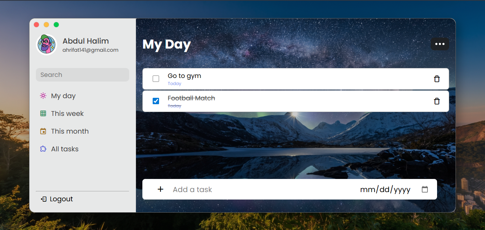
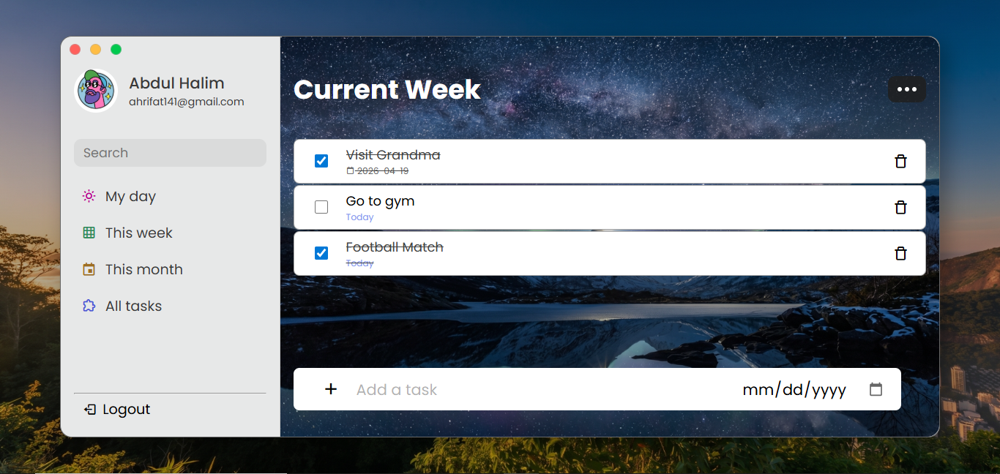
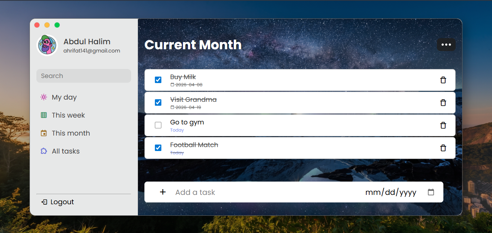
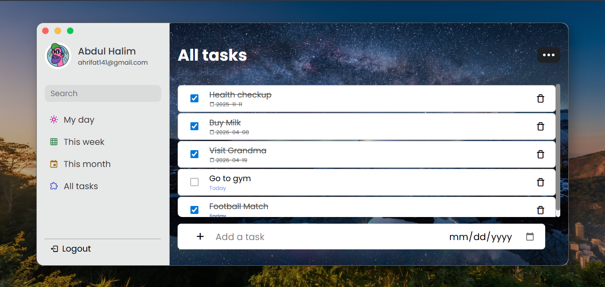

# TaskFlow — Productivity App 📝


## Table of Contents 📚

- [Overview](#overview-)
- [Features](#features-)
- [Screenshots](#screenshots-)
- [Technologies Used](#technologies-used-)
- [Installation](#installation-)
- [Usage](#usage-)
- [File Structure](#file-structure-)
- [Contributing](#contributing-)
- [License](#license-)
- [Contact](#contact-)

---

## Overview 🌟

**TaskFlow — Productivity App** is a simple and efficient task management tool that helps you stay organized and productive. With its user-friendly interface, you can easily **add**, **update**, and **delete** tasks to keep track of your daily, weekly, and monthly tasks.

This README file provides detailed information on how to use the app effectively and highlights its key features.

---

## Features 🚀

- ✅ **Add Tasks** — Create tasks with descriptions and due dates.
- 📅 **Organize Tasks** — Categorize tasks into four sections:
  - 🌤️ **My Day** — Tasks due today.
  - 📆 **Current Week** — Tasks due within the current week.
  - 🗓️ **Current Month** — Tasks due within the current month.
  - 📋 **All Tasks** — View all tasks in one place.
- ✔️ **Task Status** — Mark tasks as **completed** or **pending** using checkboxes.
- 🗑️ **Delete Tasks** — Remove tasks with a simple click on the trash icon.
- 👤 **User Profile** — Fetch and display user profile data from the `data.txt` file.
- 🔢 **Sort Tasks** — Automatically sort tasks by due dates in **ascending order**.

---

## Screenshots 📸






---

## Technologies Used 🛠️

|                                                Technology                                                |         Description         |
| :------------------------------------------------------------------------------------------------------: | :-------------------------: |
|                 |    Structure of the app     |
|                    |     Styling and layout      |
|  | App logic and interactivity |

---

## Installation ⚙️

Follow these steps to set up the project locally:

### Prerequisites

Make sure you have the following installed:

- A modern web browser (**Chrome**, **Firefox**, **Edge**, etc.)
- A code editor (**VS Code** recommended)
- **Git** installed on your machine

### Steps

1. **Clone the repository:**

```bash
git clone https://github.com/ahrifat7/TaskFlow.git
```

2. **Navigate to the project directory:**

```bash
cd TaskFlow
```

3. **Open the app:**

Simply open the `index.html` file in your browser:

```bash
open index.html
```

> Or drag and drop the `index.html` file into your browser.

---

## Usage 📖

### ➕ Adding a Task

1. Enter the **task description** in the input field.
2. Select a **due date** using the date picker.
3. Click the **"Add Task"** button to save the task.

### ✔️ Marking a Task as Complete

- Click the **checkbox** next to a task to toggle it between **completed** and **pending**.
- Completed tasks will be visually distinguished with a strikethrough.

### 🗑️ Deleting a Task

- Click the **trash icon 🗑️** next to a task to permanently remove it.

### 📅 Navigating Between Sections

Use the sidebar or navigation menu to switch between:

|     Section      |                   Description                   |
| :--------------: | :---------------------------------------------: |
|    🌤️ My Day     |          Displays tasks due **today**           |
| 📆 Current Week  | Displays tasks due within the **current week**  |
| 🗓️ Current Month | Displays tasks due within the **current month** |
|   📋 All Tasks   |  Displays **all tasks** regardless of due date  |

### 👤 User Profile

- The app fetches and displays your **profile data** from the `data.txt` file automatically upon loading.

### 🔢 Sorting Tasks

- Tasks are automatically **sorted by due date** in ascending order so the most urgent tasks appear first.

---

## File Structure 📁

```
taskflow-productivity-app/
│
├── index.html          # Main HTML file
├── style.css           # Stylesheet for the app
├── script.js           # JavaScript logic
├── data.txt            # User profile data file
├── assets/             # Images and icons
│   └── icons/          # App icons
└── README.md           # Project documentation
```

---

## Contributing 🤝

Contributions are always welcome! Follow these steps to contribute:

1. **Fork** the repository.
2. Create a new branch:

```bash
git checkout -b feature/your-feature-name
```

3. Make your changes and **commit** them:

```bash
git commit -m "Add: your feature description"
```

4. **Push** to your branch:

```bash
git push origin feature/your-feature-name
```

5. Open a **Pull Request** and describe your changes.

---

## License 📄

This project is licensed under the **MIT License** — see the [LICENSE](LICENSE) file for details.

```
MIT License

Copyright (c) 2026 MD ABDUL HALIM

Permission is hereby granted, free of charge, to any person obtaining a copy
of this software and associated documentation files (the "Software"), to deal
in the Software without restriction, including without limitation the rights
to use, copy, modify, merge, publish, distribute, sublicense, and/or sell
copies of the Software, and to permit persons to whom the Software is
furnished to do so, subject to the following conditions:

The above copyright notice and this permission notice shall be included in all
copies or substantial portions of the Software.

THE SOFTWARE IS PROVIDED "AS IS", WITHOUT WARRANTY OF ANY KIND, EXPRESS OR
IMPLIED, INCLUDING BUT NOT LIMITED TO THE WARRANTIES OF MERCHANTABILITY,
FITNESS FOR A PARTICULAR PURPOSE AND NONINFRINGEMENT. IN NO EVENT SHALL THE
AUTHORS OR COPYRIGHT HOLDERS BE LIABLE FOR ANY CLAIM, DAMAGES OR OTHER
LIABILITY, WHETHER IN AN ACTION OF CONTRACT, TORT OR OTHERWISE, ARISING FROM,
OUT OF OR IN CONNECTION WITH THE SOFTWARE OR THE USE OR OTHER DEALINGS IN THE
SOFTWARE.
```

---

## Contact 📬

Have questions or suggestions? Feel free to reach out!

- **GitHub:** [@ahrifat7](https://github.com/ahrifat7)
- **Email:** [EMAIL_ADDRESS](mailto:ahrifat141@gmail.com)
- **LinkedIn:** [MD ABDUL HALIM](https://www.linkedin.com/in/abdul-halim-bd/)

---

<div align="center">

### ⭐ If you found this project helpful, please give it a star! ⭐

Made with ❤️ by [Abdul Halim @ SuperDev](https://github.com/ahrifat7/)

</div>
